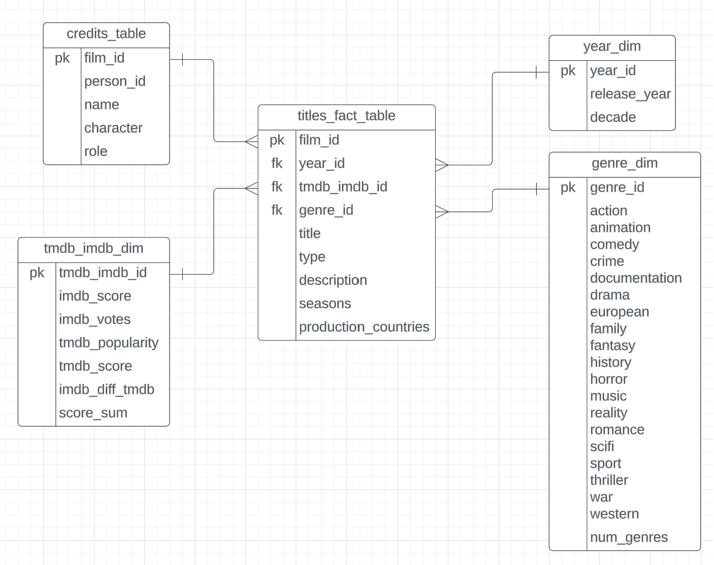
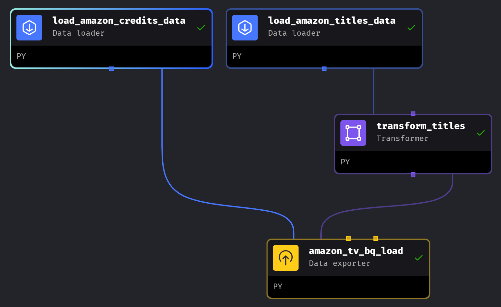
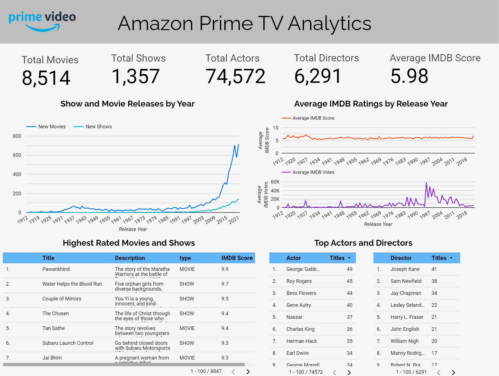

# GCP Data Engineering Project: Amazon TV Dataset Analysis

## Overview
This data engineering project focuses on modeling and analyzing the [Amazon Prime TV dataset](https://www.kaggle.com/datasets/victorsoeiro/amazon-prime-tv-shows-and-movies). There are two data tables corresponding to a set of TV shows/movies available on Amazon Prime TV and a set of corresponding actors and directors. The goal of this project is to utilize the google cloud platform to store, transform, query, and analyze data. 

## Process
- Leveraged the Google Cloud Storage platform to store raw data.
- Created a visual representation of the data model to provide a clear understanding of the dataset's structure.

- Implemented a data pipeline for Extract, Transform, Load (ETL) using Mage AI on a Google Cloud Virtual Machine.

- Loaded the transformed dataset into Google BigQuery for data warehousing data querying.
- Wrote SQL scripts in Bigquery for data analysis and visualization.
- Built a comprehensive dashboard in Looker studio offering a comprehensive view of the dataset.

  
